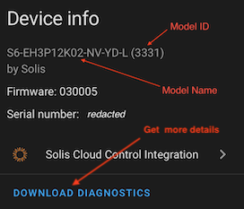

# Solis Cloud Control Integration

This is the Solis Cloud Control API integration for Home Assistant.
It allows you to read and control various settings of your Solis inverter.
See my blog post for inspiration how to use this integration: [Home Assistant Solar Energy Management](https://mkuthan.github.io/blog/2025/04/12/home-assistant-solar/).

> [!NOTE]
> If your primary goal is to monitor data from the Solis Cloud Monitoring API, you might want to explore the [Solis Sensor Integration](https://github.com/hultenvp/solis-sensor/).  
> Both integrations are complementary and can be used together to enhance your Home Assistant setup.

## Installation

After installation restart Home Assistant.

## Configuration

or add integration manually:

1. Go to "Configuration" > "Integrations"
2. Click on the "+" button in the bottom right corner
3. Search for "Solis Cloud Control"
4. Click on "Solis Cloud Control" to add the integration

Follow the configuration steps:

1. Enter your Solis API key (KeyID) and token (KeySecret).
2. Select the inverter you want to control from the list.
   For parallel connected inverters, select master inverter.

After successful configuration, the integration creates a new entity for your inverter. This entity includes the model name, model identifier, firmware version, and serial number.

## Supported data loggers

| Data logger model | Model Id | Supported |
| ----------------- | -------- | :-------: |
| S2-WL-ST          | WL       |     ✅     |
| S3-WiFi-ST        | WIFI     |     ✅     |
| DLS-W             | ❓        |     ❌     |
| DLS-L             | ❓        |     ❌     |

> [!NOTE]
> Please let me know if you have a different data logger model and it works with this integration.

## Supported inverters

All Solis inverters should be supported, although the integration has been tested with the following models:
| Model name               | Model id         | Type   |
| ------------------------ | ---------------- | ------ |
| S6-EH3P(8-15)K02-NV-YD-L | 3331             | hybrid |
| S6-EH3P(29.9-50)K-H      | 5305             | hybrid |
| S6-EH3P(12-20)K-H        | 3315             | hybrid |
| S6-EH3P(5-10)K-H         | 3306             | hybrid |
| S5-EH1P(3-6)K-L          | 3101, 3102, 3105 | hybrid |
| RHI-3P(3-10)K-HVES-5G    | CA               | hybrid |
| RHI-(3-6)K-48ES-5G       | F4               | hybrid |
| S6-GR1P(2.5-6)K          | 0200, 0205       | string |
| S6-GR1P(0.7-3.6)K-M      | 0101, 0105       | string |
| S5-GR3P(3-20)K           | 0504, 0507       | string |

> [!NOTE]
> If your inverter is not listed above, please open a GitHub issue using the "New Solis Inverter Support Request" template.
> Include your inverter's model name, model identifier, and a downloaded diagnostics report.

## Features

The integration provides a user-friendly interface to control your inverter settings. It allows you to:

* ⚡ Control storage modes: "Self-Use", "Feed-In Priority" and "Off-Grid" 🟢
* ⏱️ Schedule charge and discharge slots 🟢
* Switch the inverter on or off 🟢 ⚪️
* Toggle "Battery Reserve" 🟢
* Toggle "Allow Grid Charging" 🟢
* Toggle "Allow Export" (in "Self-Use" storage mode) 🟢
* Set maximum output power 🟢
* Set maximum export power 🟢
* Control various Battery State of Charge (SOC) levels 🟢
* Set power limit ⚪️

🟢 - Hybrid inverter  
⚪️ - String inverter

It also provides sensors for battery maximum charge and discharge current:

> [!NOTE]
> If the inverter doesn't support a specific feature, the integration don't create the corresponding control or sensor entities.

## Non-functional features

The integration also meets several non-functional requirements:

* 📦 Batch reading of all inverter settings in a single request to fit within the Solis Cloud API limits.
* 🔄 Retry logic for API requests to mitigate API stability issues.
* ✅ After changing an inverter setting, the integration reads back the updated value from the inverter to verify that the change was applied successfully.
* 🏡 Follows Home Assistant best practices for integration development to ensure a seamless and reliable user experience.

## FAQ

### What if the integration reports "B0115" error during initialization?

Most likely, your data logger is not supported by the integration, for example the "DLS-W" model.
Replace your data logger with a supported model, such as "S2-WL-ST" or "S3-WiFi-ST", to use the integration.
